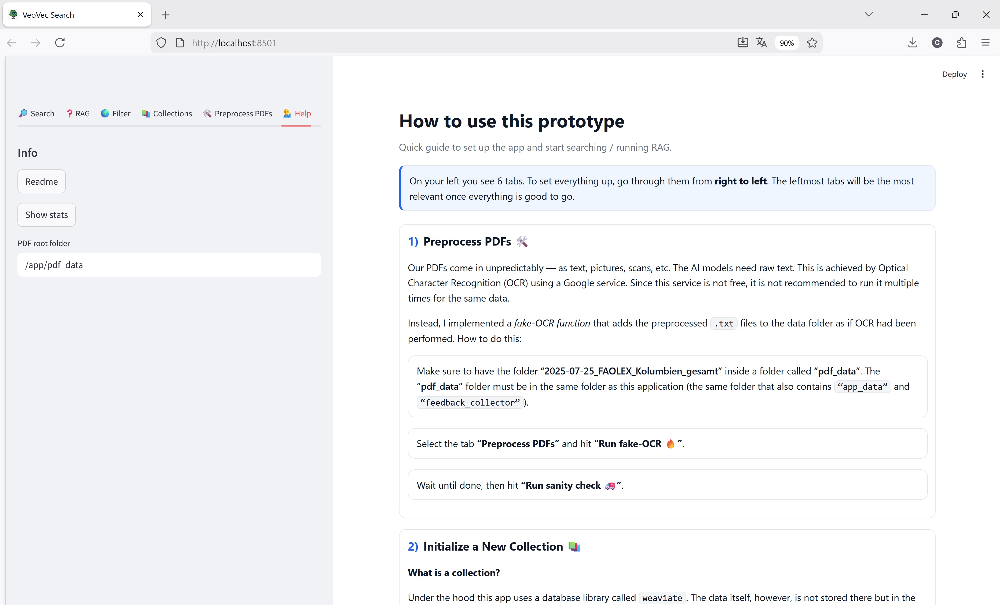
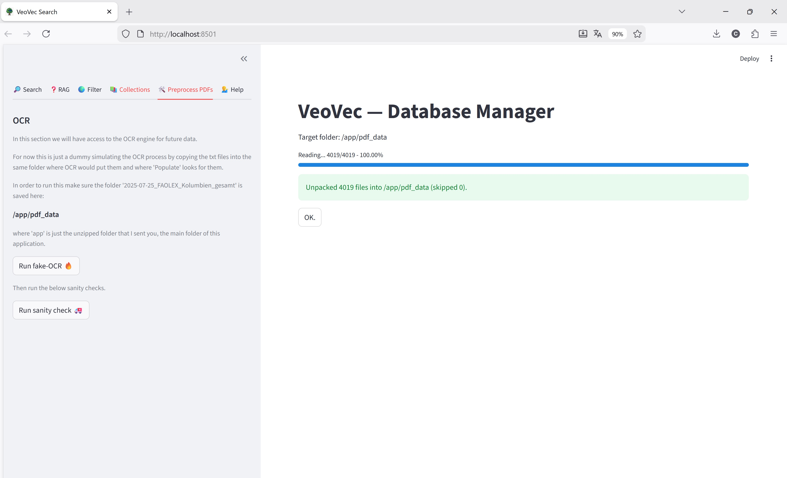
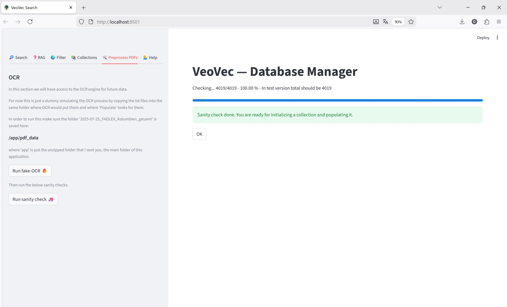
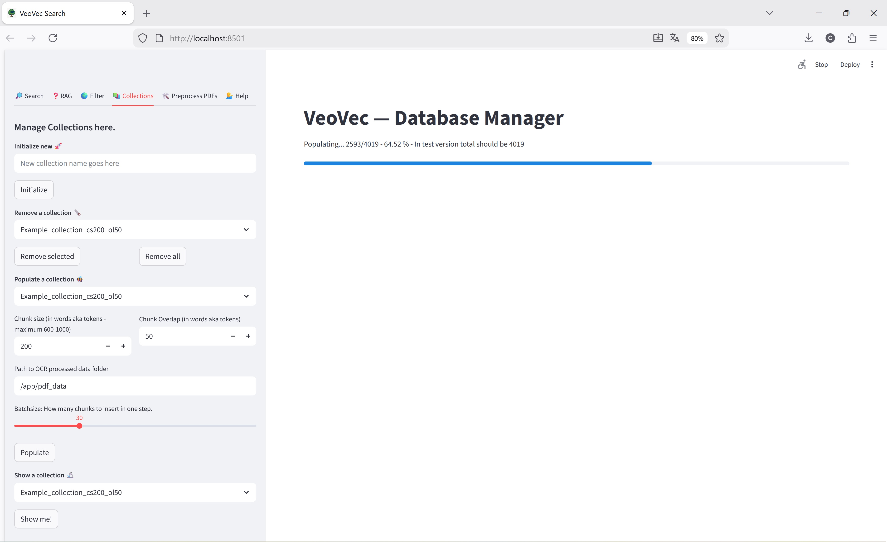
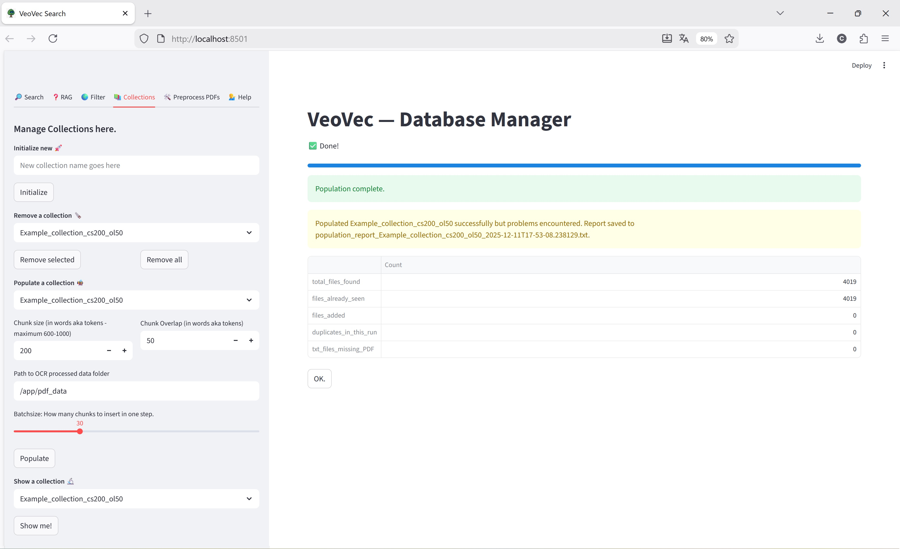
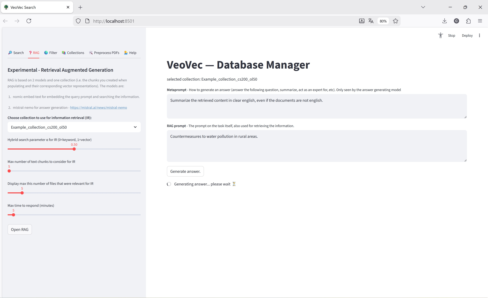
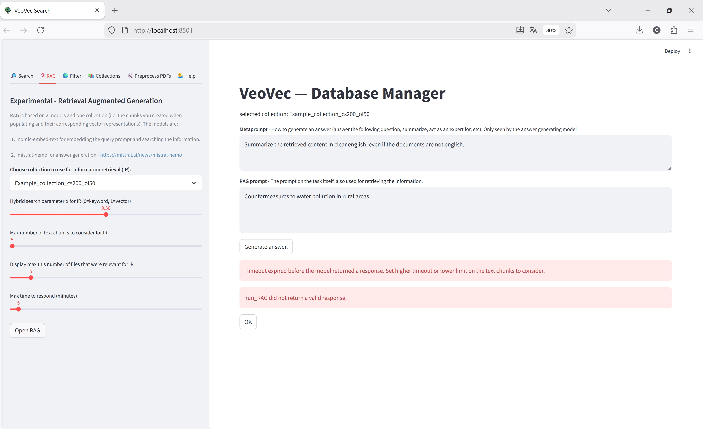
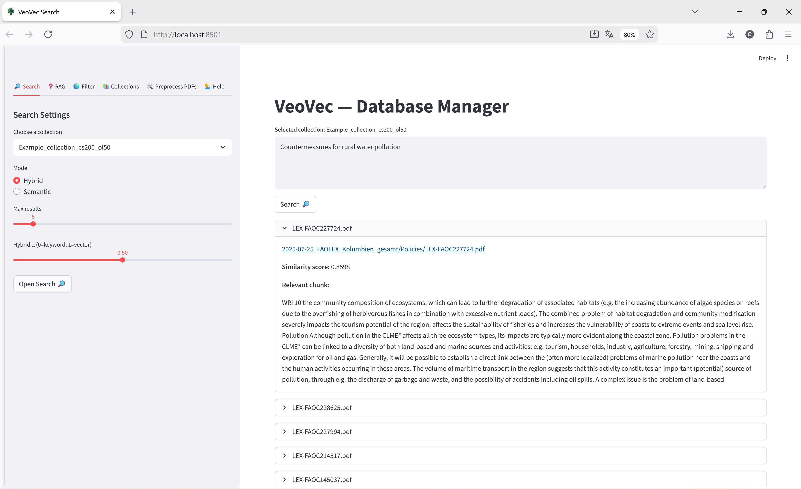

# VeoVec – Static Demo

This document provides a visual walkthrough of the VeoVec prototype: a semantic search system for large-scale legal PDF collections.  
Each screenshot illustrates core functionality and the user workflow across all major tabs in the application.

---

## 1. Welcome Screen & Navigation

Upon launching the application, users see a welcome screen and a navigation sidebar containing six main tabs.  
The interface is designed for non-technical users—simple, intuitive, and self-explanatory.

---

## 2. Help

This tab provides:

- **"Readme"** — Displays an in-app Markdown guide explaining how to use the system  
- **"Show Stats"** — Shows high-level statistics such as:
  - Number of collections  
  - Countries and languages covered  
  - Available feedback-based evaluation metrics  

Emojis and symbols are used throughout the UI for clearer guidance.

---

## 3. Preprocess PDFs

This tab controls the OCR pipeline.

The intended production pipeline uses **Google Document AI OCR**, which has shown strong performance on complex legal PDFs.  
To avoid unnecessary OCR costs during evaluation, the prototype includes a **Fake-OCR** mode that simply copies pre-generated `.txt` files into the expected directory structure.

A **sanity check** verifies that all expected files exist, paths align correctly, and the dataset is ready for ingestion.

**Notes on future OCR improvements:**

Legal PDFs vary significantly:
- Some contain extractable text  
- Some contain only images  
- Some contain text in an unreadable format requiring conversion to images  

A robust heuristic for identifying which OCR process to apply is planned for the production version.

---

## 4. Collections

Collections define independent vector indexes.

### Initialization, Removal, and Management
The interface provides safeguards and warnings when:
- Initializing a collection that already exists  
- Removing a selected collection  
- Removing all collections  

### Populating a Collection

Once chunk size, overlap, and batch size are specified, a collection can be populated with embedded text chunks.

During population, VeoVec:
- Skips files already present in the collection  
- Tracks PDFs missing corresponding `.txt` files  
- Logs ingestion statistics  
- Saves detailed reports (including problematic files) for further examination  

A **“Show Collection”** button displays summary statistics for a selected collection.

Future extensions may include:
- Filtering collections by country, language, or metadata  
- Advanced customization options during ingestion  

---

## 5. Filter (Placeholder)

This tab is reserved for future filtering functionality.

While metadata such as **country** and **language** already exists, it remains too coarse for meaningful filtering.  
The current plan is to eventually integrate filtering directly into the Search tab (e.g., restrict search to specific languages or regions).

---

## 6. Retrieval-Augmented Generation (RAG)

This tab enables experimental RAG functionality.

Large legal documents and multilingual text make grounded answer generation challenging.  
Local inference of large models (e.g., Mistral-Nemo) often leads to **Ollama or Weaviate timeouts**.  
Nevertheless, the prototype includes this section for experimentation.

Planned improvements include:

1. **Switching to more efficient models** (e.g., xLSTM – https://arxiv.org/abs/2405.04517)  
2. **Migrating generation to cloud infrastructure**  
3. **Separating retrieval from generation** to eliminate bottlenecks  

A manual “increase timeout” option exists for experimentation, though this is not a long-term solution.

When successful, RAG mode displays:
- The generated answer  
- All retrieved text chunks  
- Corresponding metadata  
- A feedback widget for rating answer quality  
  (Used later to evaluate which collection configurations perform best)

---

## 7. Search (Core Functionality)

This is the primary feature of the system.

Users can enter free-text queries and choose between:

- **Semantic Search** (vector similarity)
- **Hybrid Search** (combined BM25 + vector search with adjustable &alpha; parameter)

Results include:
- Filename  
- Similarity score  
- Relevant text chunk  
- A direct clickable link to open the PDF in a new browser tab  

---

## End of Demo

This static walkthrough illustrates the core features and user workflow of the VeoVec prototype.  
The system is designed to support large-scale, multilingual legal document collections, with flexible ingestion, semantic retrieval, and experimental RAG capabilities.

---

## Outline

In addition to the improvements already noted, a long-term objective is the construction of a knowledge graph over the legal corpus to enable structured retrieval and knowledge-grounded RAG. This is a non-trivial task requiring robust entity extraction, relation modeling, and ontology design, but it represents a promising direction for improving explainability, retrieval quality, and system transparency.

